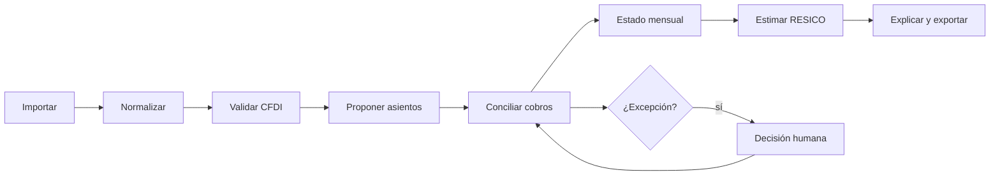

# Fundamento de producto y dominio V0

## Usuario y resultado

Una Persona Física RESICO importa un mes de CFDI y movimientos, resuelve excepciones y obtiene un estado mensual explicable para revisarlo antes de entrar al SAT. El V0 no presenta declaraciones ni mueve dinero.

## Flujo mínimo



## Modelo de dominio propuesto

No crear estas tablas hasta validar invariantes y consultas. Es la frontera mínima, no un ERP.

| Entidad | Responsabilidad | Invariantes |
|---|---|---|
| `users` | Identidad de plataforma | Sin datos fiscales como clave de acceso |
| `entities` | Contribuyente/negocio fiscal | RFC cifrado o protegido; zona y régimen versionados |
| `memberships` | Acceso usuario-entidad | Rol explícito; toda consulta verifica membresía |
| `import_batches` | Una operación de importación | Actor, tiempo, fuente, conteos y resultado |
| `source_artifacts` | Archivo original o extracto bancario | Hash, tamaño, MIME, almacenamiento, retención, sin mutación |
| `cfdi_documents` | Hechos normalizados del CFDI | UUID y hash; niveles de validación separados; conserva raw |
| `bank_transactions` | Hecho monetario observado | Cuenta, fecha, importe, moneda y fuente; sin categoría implícita |
| `reconciliation_matches` | Relación CFDI-movimiento/cobro | Método, confianza, explicación y decisión humana |
| `accounts` | Catálogo contable mínimo | Tipo estable y moneda definida |
| `journal_entries` | Evento contable versionado | Fecha, descripción, procedencia, estado draft/posted/reversed |
| `postings` | Cargos y abonos | Suma cero por asiento y moneda; cantidades exactas |
| `tax_rule_sets` | Regla fiscal versionada | Fuente, vigencia, fecha de corte y hash de configuración |
| `tax_estimates` | Resultado reproducible | Periodo, hechos incluidos, ruleset, desglose y advertencias |
| `audit_events` | Quién hizo qué y por qué | Append-only; actor, comando, objeto, antes/después referenciado |

## Por qué doble partida

Los sistemas maduros revisados usan asientos balanceados porque un cobro afecta al menos dos lugares y una corrección necesita conservar historia. Wedge debe usar doble partida internamente para evitar totales independientes. La interfaz puede seguir hablando de ingresos, gastos, cobros y pendientes.

**Regla:** por cada `journal_entry` contabilizado, la suma de `postings.amount` es cero por moneda. No mezclar importes CFDI de precisión decimal con saldos bancarios en centavos sin una política explícita de cuantización.

## Separación de capas

```text
Fuente inmutable → hecho normalizado → interpretación → asiento → estimación fiscal
      hash           campos CFDI       confianza       balance      ruleset
```

- Una nueva interpretación no reescribe el archivo ni el movimiento.
- Reconciliar no modifica el importe fuente.
- Contabilizar exige un comando y conserva quién aprobó.
- La estimación fiscal consulta hechos/asientos elegibles y registra exactamente cuáles.
- Una explicación enlaza cada número hasta la fuente y la regla.

## Estados permitidos

| Objeto | Estados iniciales |
|---|---|
| Importación | recibida, procesando, procesada, parcial, rechazada |
| CFDI | leído, estructura_válida, timbre_verificado, sat_vigente, sat_cancelado, revisión |
| Conciliación | propuesta, confirmada, rechazada, reemplazada |
| Asiento | borrador, contabilizado, reversado |
| Estimación | calculada, revisada, obsoleta |

No crear estados `presentado` o `pagado` en V0 porque no se recolecta la evidencia necesaria.

## NOW / NEXT / LATER

### NOW — base confiable

1. Cerrar vulnerabilidades y verificación de tipos.
2. Definir entidad fiscal, procedencia y bitácora.
3. Importar manualmente CFDI 4.0 con archivos sintéticos y después un conjunto redactado aprobado.
4. Importar CSV bancario con un formato inicial.
5. Proponer/confirmar conciliaciones y asientos balanceados.
6. Calcular ISR RESICO desde hechos enlazados y exportar explicación.

### NEXT — uso repetido

1. Más formatos bancarios y reglas aprendidas del usuario.
2. Consulta de estado CFDI en SAT sin credenciales persistentes.
3. Complementos de pago, notas de crédito, devoluciones e IVA según revisión fiscal.
4. Operación de privacidad, backups y observabilidad.
5. Piloto de tres cierres mensuales con el fundador y después pocos usuarios invitados.

### LATER — sólo con evidencia

- Puente local para descarga SAT; nunca e.firma en nube.
- Conectores bancarios de sólo lectura.
- Asistencia por IA para clasificación y explicación con aprobación.
- Colaboración con contador, multi-entidad y roles avanzados.
- Presentación fiscal, pagos, trading, inversiones, crédito, nómina, inventario y ERP.

## Métricas de salida del V0

- 100% de cifras del estado enlazadas a fuente y regla.
- 100% de asientos contabilizados balanceados por moneda.
- Cero cruces de entidad en pruebas de autorización.
- Cero estados fiscales sin evidencia requerida.
- Menos de 10 decisiones manuales para un mes sencillo del fundador.
- Explicar el origen de cinco cifras elegidas al azar en menos de dos minutos cada una.
