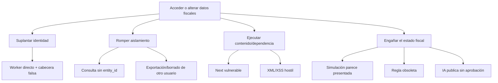

# Modelo de amenazas — 2026-09-14

## Alcance

Demo privada en Sites, Worker Vinext, D1, navegador y XML sintéticos. También anticipa la importación manual del V0. No cubre todavía integraciones bancarias de escritura, presentación fiscal ni un puente local SAT.

**Activos:** identidad, perfil fiscal, CFDI, movimientos, decisiones, asientos, estimaciones, acuses, exportaciones y registros de auditoría.

**Adversarios/fallos:** usuario de otra cuenta, atacante web, dependencia comprometida, archivo hostil, operador con acceso, error de reglas, indisponibilidad y borrado accidental.

## Matriz priorizada

| ID | Amenaza | Severidad | Prob. | Impacto | Control actual | Mitigación siguiente |
|---|---|---:|---:|---|---|---|
| T1 | Dependencia vulnerable permite ejecución o lectura indebida | Crítica | Media | Control del Worker o datos | Next actualizado; auditoría de producción en cero el 2026-09-14 | Corregir toolchain en WDG-002A; auditoría recurrente; SBOM/advisories en releases |
| T2 | Worker expuesto fuera de Sites acepta identidad falsificada | Crítica | Media | Suplantación total | Advertencia documental | Probar/declarar topología; bloquear despliegue directo o verificar sesión propia |
| T3 | Consulta/objeto sin filtro de propietario cruza datos | Crítica | Media | Exposición fiscal entre cuentas | Filtro `user_id` y pruebas A/B en una tabla | `entity_id` en toda clave/consulta, repositorios tipados y pruebas negativas por recurso |
| T4 | e.firma/CIEC se almacena o registra en nube | Crítica | Baja hoy | Suplantación fiscal y firma legal | No existen conectores; prohibición documental | Mantener fuera del V0; puente local, memoria efímera y threat model independiente |
| T5 | Estado simulado o estimación se presenta como declaración/pago real | Alta | Media | Decisión fiscal errónea | Textos de simulación | Estados respaldados por evidencia; vocabulario cerrado; pruebas de UI/API |
| T6 | XML hostil causa XXE, expansión o agotamiento | Alta | Media al habilitar carga | Caída, lectura local o costo | Rechazo DTD/ENTITY, 128 KiB, nodos/profundidad | Streaming/aislamiento, MIME real, cuarentena, cuotas y corpus adversarial |
| T7 | XSS por metadatos de CFDI o nombres | Alta | Media | Secuestro de sesión/acciones | Presentación escapa valores; CSP | Prohibir `innerHTML` con datos, sanitización central y pruebas con payloads |
| T8 | Corrupción parcial de fila JSON o carrera | Alta | Media | Historia y cálculos incorrectos | Versión/revisión optimista | Tablas normalizadas, transacciones, restricciones y eventos idempotentes |
| T9 | Regla fiscal obsoleta o mal aplicada | Alta | Alta | Impuesto estimado incorrecto | Ruleset visible y cálculo puro | Vigencia/versiones, fuentes, casos, revisión profesional y comparación SAT |
| T10 | Borrado/backup/restore incompleto | Alta | Media | Pérdida o retención indebida | Política aprobada; tombstone previo, borrado completo y reconciliador offline probados localmente | Lock/lifecycle remoto, descarga y restore aislado |
| T11 | API abusada sin cuotas | Media | Media | Indisponibilidad/costo | Cuerpo pequeño y misma procedencia | Límites por usuario/IP, métricas sin PII y respuestas uniformes |
| T12 | Logs/errores filtran datos fiscales | Alta | Media futura | Exposición persistente | Mensajes genéricos; no registra cabeceras | Allowlist de campos, redacción, retención corta y pruebas de fallos |
| T13 | Exportación sensible queda en equipo compartido | Media | Media | Exposición local | Ruta autenticada, respuesta `no-store`, ZIP con nombre neutro y aviso de copia privada; no filtra claves R2 | Validar el flujo en móvil y añadir guía del piloto antes de documentos reales |
| T14 | IA sufre prompt injection o produce asientos sin evidencia | Alta | Media futura | Manipulación del libro/explicación | IA ausente | Tratar documentos como datos, herramientas allowlist, salida estructurada y aprobación |
| T15 | Conector externo altera dinero | Crítica | Baja futura | Pérdida financiera | No hay conectores | Integraciones sólo lectura en primeras etapas; permisos mínimos y kill switch |

## Árbol de ataque principal

## Invariantes de seguridad

1. Toda lectura/escritura pertenece a un `entity_id` derivado de una membresía autenticada en servidor.
2. Ningún identificador de propietario enviado por cliente decide autorización.
3. Importar no ejecuta, publica, contabiliza ni cambia un estado fiscal.
4. Cada cifra deriva de hechos inmutables y una regla/version; cada corrección deja rastro.
5. Presentado y pagado requieren evidencia externa enlazada.
6. Wedge no recibe la clave privada e.firma ni su contraseña.
7. Integraciones financieras empiezan con permisos de sólo lectura.
8. Una respuesta de IA es una propuesta; un comando determinista y autorizado realiza cambios.

## Gates antes de datos reales

- Cero vulnerabilidades críticas/altas con corrección disponible en dependencias de producción.
- Toolchain de desarrollo sin avisos altos explotables en el flujo de archivos o servidor local.
- Typecheck, lint, pruebas y build obligatorios en CI.
- Límites de archivo y corpus XML adversarial.
- Esquema normalizado con aislamiento y auditoría.
- Política de retención y ejercicio de respaldo/restauración con datos sintéticos.
- Revisión de textos/estados fiscales y fuentes vigentes.
